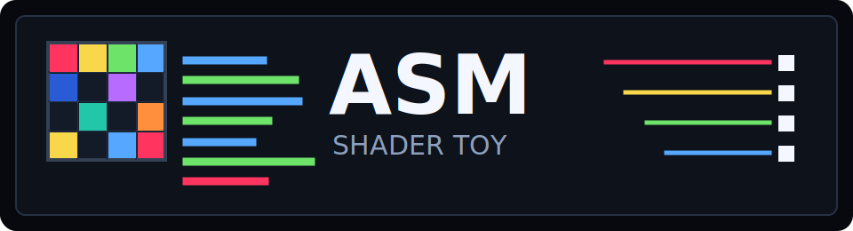
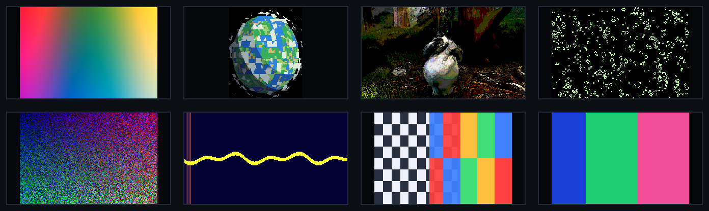

# asm-shader-toy

<p align="center">
  
</p>

`asm-shader-toy` is a tiny Shadertoy-like playground where the shader is a small
assembly language run once per pixel on the CPU. It is meant to feel like a
learnable fake machine: registers, labels, branches, subroutines, texture
channels, feedback buffers, and a visible rendering harness.

<p align="center">
  
</p>

## Features

- CPU VM renderer with a default GBA-size intermediate texture: `240x160`.
- SDL2 window with nearest-neighbor scaling, hot reload, FPS overlay, pause, and reset.
- Assembly language with labels, local labels, includes, aliases, constants, `.consts`, branches, calls, and bounded execution.
- Shadertoy-style inputs for resolution, time, frame, date, mouse, keyboard, and gamepad.
- Channels for PNG/JPEG images, streaming video, webcam, audio files, microphone, generated noise, and feedback buffers.
- Headless `--dry-run`, `--no-graphics`, `--save-frame`, and `--measure-fps` modes for validation and profiling.

## Build

```sh
./scripts/build.sh
```

Validate every checked-in example without opening a window:

```sh
./scripts/validate_examples.sh
```

This also runs the browser tests/build with native-vs-browser WGSL compiler
parity fixtures enabled.

Emit WGSL for a full image-plus-buffer project:

```sh
./build/asm-shader-toy examples/buffers/life_display.asm \
  --buffer0 examples/buffers/life_buffer.asm \
  --emit-wgsl-bundle /tmp/asm-shader-toy-wgsl
```

Build the browser prototype:

```sh
cd web
npm install
npm run build
```

Build the optional native WebGPU tools:

```sh
./scripts/build_webgpu_probe.sh
./build-webgpu-probe/ast-webgpu-probe
./build-webgpu-probe/ast-webgpu-frame examples/basics/plasma.asm \
  --size gba \
  --compare-cpu \
  --output /tmp/asm-shader-toy-gpu.ppm
./build-webgpu-probe/ast-webgpu-frame examples/textures/multi_image_mix.asm \
  --size 64x64 \
  --channel0 examples/assets/checker.png \
  --channel1 examples/assets/bars.png \
  --compare-cpu
./build-webgpu-probe/ast-webgpu-frame examples/textures/noise_field.asm \
  --size 64x64 \
  --noise0 42 \
  --compare-cpu
./build-webgpu-probe/ast-webgpu-frame examples/buffers/ramp_display.asm \
  --buffer0 examples/buffers/ramp_buffer.asm \
  --size 32x24 \
  --frames 4 \
  --compare-cpu
./build-webgpu-probe/ast-webgpu-frame examples/video/video_texel.asm \
  --video0 examples/assets/video/testsrc_160x90.mp4 \
  --size 160x90 \
  --time 0.5 \
  --compare-cpu
./build-webgpu-probe/ast-webgpu-frame examples/audio/audio_scope.asm \
  --audio0 examples/assets/audio/two_tone.wav \
  --size 64x32 \
  --time 0.25 \
  --compare-cpu
./build-webgpu-probe/ast-webgpu-run examples/basics/plasma.asm \
  --size gba \
  --scale 4
./build-webgpu-probe/ast-webgpu-run examples/webcam/webcam_channel.asm \
  --webcam0 \
  --size gba \
  --scale 4
./build-webgpu-probe/ast-webgpu-run examples/microphone/mic_scope.asm \
  --mic0 \
  --size gba \
  --scale 4
./build-webgpu-probe/ast-webgpu-surface-probe --size 160x90 --frames 60 --scale 2
./scripts/validate_webgpu_frame.sh
```

The probe requests a native WebGPU adapter/device, dispatches a tiny handwritten
compute shader, then runs a WGSL shader emitted from asm into an `rgba8unorm`
storage texture and verifies CPU readback pixels. The frame tool renders one
deterministic asm image pass through emitted WGSL and can compare the GPU
readback with the CPU VM, including static image, generated noise, and feedback
buffer channels. It can also sample a deterministic frame from video channels.
Audio-file channels are decoded into the same 512x2 waveform/spectrum texture
shape as the CPU runner.
The `ast-webgpu-run` tool opens an SDL window, renders emitted asm WGSL on the
GPU, and presents the intermediate texture with nearest-neighbor integer
scaling. It can also stream mirrored webcam and microphone channels into GPU
textures.
The surface probe opens an SDL window, creates a native WebGPU surface, clears
it, and presents frames.

## Run

Default demo:

```sh
./scripts/run.sh
```

Specific examples:

```sh
./build/asm-shader-toy examples/basics/plasma.asm --size gba --scale 4
./build/asm-shader-toy examples/raymarch/pixelated_planet.asm --size gba --scale 4
./build/asm-shader-toy examples/buffers/life_display.asm \
  --buffer0 examples/buffers/life_buffer.asm \
  --size gba \
  --scale 4
```

Graphical runs hot reload the active program and any `.include` dependencies on
save. If a reload has assembly errors, diagnostics are printed and the last good
program keeps running.

## Browser Prototype

The `web/` app is the first WebGPU/browser slice. It has a multi-file project
editor, prototype asm-to-WGSL compilation for the core language subset, a WGSL
editor, import/export JSON, compressed share URLs, and a WebGPU preview canvas
with nearest-neighbor scaling. The preview has pause, reset, FPS display, and
PNG frame export controls. ASM and WGSL edits hot-compile after a short debounce.

Hosted build:

https://wegfawefgawefg.github.io/asm-shader-toy/

Run it locally:

```sh
cd web
npm run dev
```

The browser compiler currently covers includes, aliases, `.const`, `.consts`,
labels, branches, calls, arithmetic, texture/channel metadata ops, live input
query ops, and color output. Image files, generated noise textures, live webcam
streams, microphone analyser channels, and user-selected video files can be
loaded into `channel0..3` from the sidebar. URL-backed videos are supported when
the remote server permits browser media/CORS access. User-selected audio files
can also feed 512x2 waveform/spectrum channel textures. Image/noise channels are
preserved in exported/shared project bundles; webcam, microphone, video, and
audio channels save their metadata but reconnect through local browser
permission or file selection. Feedback buffer passes can be assigned to
`buffer0..3` from project files in the sidebar. For examples outside the browser
compiler subset, use the native CLI to emit WGSL, then paste it into the WGSL
panel:

```sh
./build/asm-shader-toy examples/basics/time_pulse.asm --emit-wgsl -
```

Useful app controls:

- `Ctrl+P`: pause/resume shader time and frame stepping.
- `Ctrl+R`: reset shader time, frame count, and feedback buffers.
- `Escape`: quit.

Plain keys remain visible to shaders through `key`.

## Channels

Static images:

```sh
./build/asm-shader-toy examples/textures/multi_image_mix.asm \
  --channel0 examples/assets/checker.png \
  --channel1 examples/assets/bars.png
```

Streaming video through local `ffmpeg`/`ffprobe`:

```sh
./build/asm-shader-toy examples/video/poster_edges.asm \
  --video0 examples/assets/video/big_buck_bunny_4m34s_640x360.mp4 \
  --size 320x180 \
  --scale 2
```

Webcam through local `ffmpeg`/V4L2:

```sh
./build/asm-shader-toy examples/webcam/webcam_channel.asm \
  --webcam0 \
  --size 320x240 \
  --scale 2
```

Audio files and microphone channels:

```sh
./build/asm-shader-toy examples/audio/audio_scope.asm \
  --audio0 examples/assets/audio/two_tone.wav \
  --size 320x180 \
  --scale 2

./build/asm-shader-toy examples/microphone/mic_scope.asm \
  --mic0 \
  --size 320x180 \
  --scale 2
```

Generated noise:

```sh
./build/asm-shader-toy examples/textures/noise_field.asm \
  --noise0 42 \
  --size gba \
  --scale 4
```

## Headless

```sh
./build/asm-shader-toy examples/basics/plasma.asm --dry-run
./build/asm-shader-toy examples/basics/plasma.asm --no-graphics --frames 10
./build/asm-shader-toy examples/raymarch/pixelated_planet.asm \
  --size gba \
  --frames 90 \
  --save-frame /tmp/pixel_planet.png
./build/asm-shader-toy examples/raymarch/pixelated_planet.asm --measure-fps 120
```

## Language Snapshot

Every pixel starts with fixed input registers:

- `r0/r1`: pixel x/y
- `r2`: shader time in seconds
- `r3/r4`: render width/height
- `r5..r9`: mouse position/button/click inputs
- `r10`: frame
- `r11`: time delta
- `r12..r15`: local date inputs

Built-in names like `px`, `py`, `time`, `width`, `height`, and `mouse_down`
can be used instead of raw input registers. Scratch registers start at `r16`.
Colors are written with `out` for normalized `0..1` channels or `out8` for byte
`0..255` channels.

Texture/channel instructions:

```asm
tex dr, dg, db, da, channel, u, v
texel dr, dg, db, da, channel, x, y
chdim dw, dh, channel
chtime dst, channel
chsrate dst, channel
```

Live input queries:

```asm
key dst, scancode
mbtn dst, button
mwheel dx, dy
gbtn dst, button
gaxis dst, axis
```

Multi-file programs use `.include` with paths relative to the including file.
Includes are once-by-default after canonical path resolution:

```asm
.include "common/math.inc"
.include <std/screen.inc>
```

`std/screen.inc` defines conventional scratch aliases such as `uv_x`, `uv_y`,
`pos_x`, `pos_y`, `color_r`, `tex0_r`, `tex1_r`, and `tmp0`.

See [examples/README.md](examples/README.md), [docs/assembly.md](docs/assembly.md),
[docs/inputs.md](docs/inputs.md), [docs/performance.md](docs/performance.md), and
[docs/scope.md](docs/scope.md).

## Size Presets

`--scale` and `--dimscale` are aliases. The default render uses scale `4`;
passing `--size` uses scale `1` unless you also pass `--scale`.

`--size` accepts `WxH` or a preset name:

- `gb`, `gameboy`, `gbc`, `gameboycolor`: `160x144`
- `gba`: `240x160`
- `nes`: `256x240`
- `snes`: `256x224`
- `genesis`, `megadrive`: `320x224`
- `sms`, `mastersystem`: `256x192`
- `n64`, `ps1`, `psx`, `spelunky`: `320x240`
- `ds`, `nds`: `256x192`
- `psp`: `480x272`

The interpreter always renders the intermediate texture size; SDL scales that
texture into the window.
